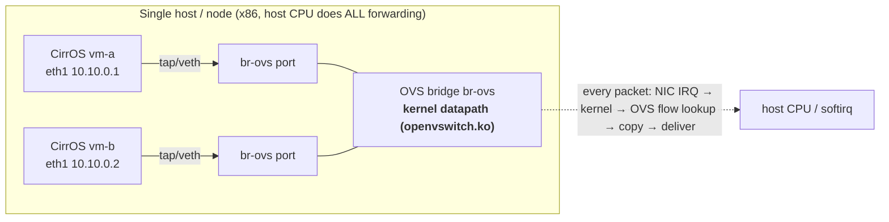
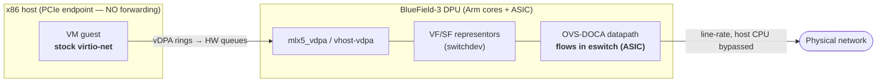

# From Software OVS Datapath to DPU-Accelerated vDPA Offload (BlueField-3)

**Assignment 2 — Hardware Offload Conceptualization**
**Author:** Vicky Sharma · github.com/vickysharma-prog · 2026-07-02

This document explains exactly how the **software** datapath built in this lab (k3s + host Open
vSwitch + Multus/OVS-CNI + KubeVirt) changes when the same VM networking is moved to an **NVIDIA
BlueField-3 (BF3) DPU** with **hardware offload** via **vDPA + OVS-DOCA** in **switchdev** mode.

---

## 1. What this lab actually built (the software datapath)

Concretely, when `vm-a` pings `vm-b`:

1. The KubeVirt `bridge`-bound interface puts a **tap/veth** for each VM into a port on the OVS
   bridge `br-ovs` (created by **ovs-cni** per the `NetworkAttachmentDefinition`).
2. The first packet **misses** the kernel flow cache → upcall to `ovs-vswitchd` (userspace) →
   a flow is installed into the **kernel datapath** (`openvswitch.ko`).
3. Every subsequent packet is switched by the **host CPU** in the kernel datapath. Throughput and
   latency are bounded by host cores; under our WSL/emulation lab there is no acceleration at all.

Verification in this lab: `ovs-ofctl dump-flows br-ovs --format=json` (control-plane / OpenFlow
view) and `ovs-appctl dpctl/dump-flows` (datapath view) — both show flows handled **in software**.

---

## 2. The three mechanisms that move this into hardware

Moving to BF3 replaces the host-CPU kernel datapath with an **embedded-switch (eswitch) datapath
inside the DPU ASIC**, while the guest is unchanged. Three mechanisms make that work:

### 2.1 switchdev / eswitch mode + VF/SF representors
The NIC/DPU embedded switch is modeled in the kernel via **switchdev**. Each SR-IOV **VF** (or
scalable **SF**) that a VM attaches to gets a **representor** netdev on the switch side. OVS
programs flows against **representors**; the ASIC then steers packets VF→wire **without the host
CPU**. This replaces the `veth`↔`br-ovs` plumbing of §1 with `VF`↔`representor`↔`eswitch`.

### 2.2 OVS-DOCA (hardware flow steering)
On BF3, OVS runs with the **OVS-DOCA** datapath. Instead of installing flows into
`openvswitch.ko`, `ovs-vswitchd` pushes them — via **DOCA Flow** — into the ASIC's eswitch
(connection tracking, encap/decap, metering all offloaded). OpenFlow/OVSDB control plane is
unchanged; only the datapath moves to silicon.

### 2.3 vDPA — why the guest stays "stock"
**vDPA (vhost Data Path Acceleration)** lets the guest keep the **standard `virtio-net`** driver
while the data rings map directly to hardware queues. Control plane is mediated by `vhost-vdpa`;
the backing driver on BF3 is **`mlx5_vdpa`**. The guest is therefore **portable and migratable**
(no vendor driver inside the VM) yet runs at line rate. This is the crux: `vm-a`'s guest image
does not change — only what sits behind its virtio-net device does.

### 2.4 BF3 "DPU mode"
In **DPU (separated) mode**, OVS-DOCA runs on the **DPU's Arm cores**, and the x86 host is a PCIe
endpoint that only sees VFs/SFs — it has **no control** over the switch. That isolation is exactly
what a cloud operator wants (tenant host cannot touch the fabric).

---

## 3. Software → hardware, element by element

| This lab (software) | BlueField-3 (hardware offload) |
|---|---|
| KubeVirt `bridge` binding → tap/veth into `br-ovs` | KubeVirt attaches a **VF/SF** (SR-IOV) to the VM; `vhost-vdpa` device |
| Guest `virtio-net` served by host QEMU | Guest **`virtio-net`** served by **`mlx5_vdpa`** (same guest driver!) |
| OVS **kernel datapath** (`openvswitch.ko`) on host CPU | OVS **DOCA datapath** in the BF3 **eswitch** (ASIC) |
| OVS ports = veth peers | OVS ports = **VF/SF representors** (switchdev) |
| Forwarding on **host CPU** (softirq) | Forwarding in **DPU silicon**; host CPU bypassed |
| ovs-cni `NetworkAttachmentDefinition` (`type: ovs`) | SR-IOV/DPU resource + accelerated **OVN-Kubernetes** / DPF `DPUServiceInterface` |
| Control plane + datapath both on host | Control plane on **DPU Arm**; datapath in **ASIC** |

The **control plane (OpenFlow/OVSDB) is identical** — that is why this software lab is a faithful
stepping stone. Only the datapath location changes.

---

## 4. The offloaded datapath

---

## 5. How you PROVE the offload is real (not a silent software fallback)

This is the part operators most often get wrong — "offloaded" is asserted but not verified.

| Claim | Evidence |
|---|---|
| Flows are in hardware | `ovs-appctl dpctl/dump-flows type=offloaded` lists them; flows carry the **`offloaded:yes` / `in_hw`** marker |
| Host CPU is bypassed | `mpstat`/`perf` show **flat host softirq** while throughput climbs |
| Traffic really uses the VF/representor | **representor / `ethtool -S`** hardware counters increment; host kernel datapath counters do **not** |
| Guest is unmodified | guest still runs **stock `virtio-net`** — no vendor driver inside the VM |

If `dpctl/dump-flows` shows the flows only under the **software** datapath (no `offloaded:yes`),
the stack has silently fallen back to host forwarding — the offload is not actually happening.

---

## 6. Where this connects to Kubernetes / OpenShift (and Assignment 1)

On OpenShift, **NVIDIA DPF (DOCA Platform Framework)** provisions BF3 (flashes the BFB, forms a
`DPUCluster`) and runs **accelerated OVN-Kubernetes** with the OVS datapath offloaded to the DPU;
**KubeVirt** VMs then ride the offloaded fabric exactly like the CirrOS VMs here ride `br-ovs`.
The vendor-neutral **OPI DPU Operator** is how this is exposed without locking to one vendor — the
integration design for bringing DPF under the OPI operator is the subject of **Assignment 1**
(`architecture_design.md`), so the two assignments meet precisely here: this lab is the *software*
datapath; DPF/BF3 is its *hardware-offloaded* form; OPI is the *vendor-neutral control surface*.

---

## 7. What changes in THIS lab's manifests on BF3 (concrete diff)

- **`NetworkAttachmentDefinition`**: `type: ovs` (host bridge) → an SR-IOV/DPU-backed network
  (e.g. `sriov`/DPF `DPUServiceInterface`) whose `resourceName` maps to a **VF/SF pool** on BF3.
- **VM interface binding**: KubeVirt `bridge: {}` → a **vDPA/SR-IOV** binding so the VM gets a VF
  served by `mlx5_vdpa` (guest still sees `virtio-net`).
- **`cluster_setup.sh`**: replace "create host OVS bridge + kernel datapath" with "put NIC in
  **switchdev**, instantiate VFs/SFs, run **OVS-DOCA** on the DPU Arm". `useEmulation` disappears —
  BF3 provides real acceleration.
- **Verification**: `ovs-ofctl dump-flows` (unchanged control-plane view) is now backed by
  `dpctl/dump-flows type=offloaded` showing **`in_hw`** flows.

**Bottom line:** the guest, the OVS control plane, and the OpenFlow view stay the same; the
datapath moves from **host CPU (kernel/openvswitch.ko)** to **DPU silicon (eswitch/OVS-DOCA)**,
reached by the VM through **vDPA** so it never needs a vendor driver.
